# Roami — 福島おでかけ・イベント発見アプリ

RaiseTech の最終課題として作成した、福島県の個人予定管理と地域イベント発見を一つにまとめた Web アプリです。  
地域イベントの検索・カレンダー管理に加え、観光スポット・グルメ情報の閲覧、AI チャットによるおでかけ提案など、  
「旅の前から旅の後まで」をサポートします。

---

## デモ（本番環境）

> AWS EC2 にデプロイ済みです。ログインなしでも一部機能をお試しいただけます。

**アクセス URL:** http://13.114.226.79

---

## デモ動画

> ログインからイベント管理・スポット検索・マップ制覇まで、主要機能の流れをご覧いただけます。


> 動画ファイル（音声なし MP4）は [docs/assets/demo.mp4](docs/assets/demo.mp4) からダウンロードできます。

---

## スクリーンショット

### ホームページ（未ログイン）

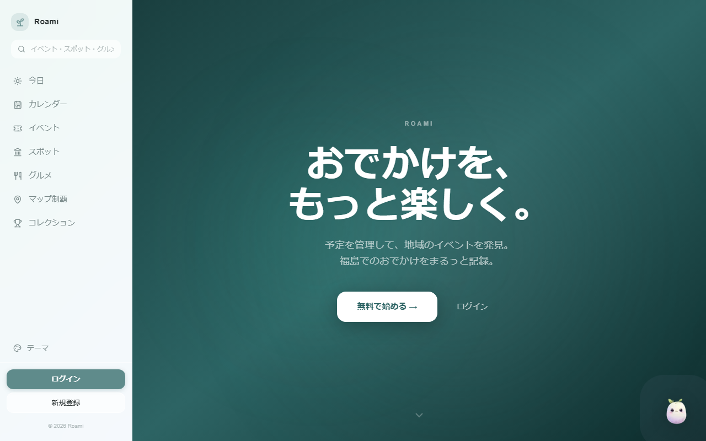

### イベント一覧

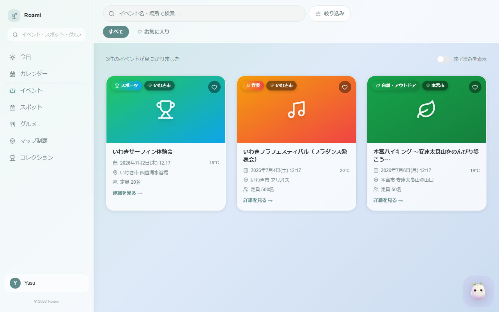

### イベント詳細

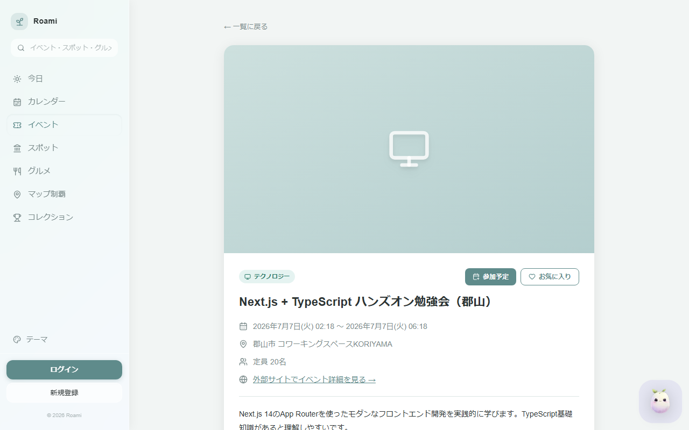

### カレンダー（予定管理）

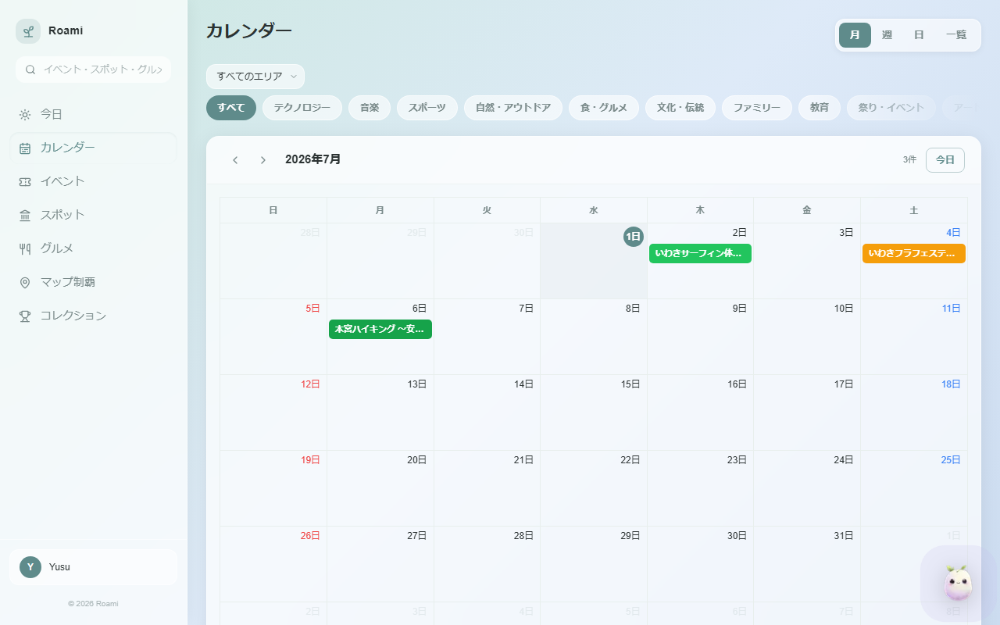

### 観光スポット（SVG マップ × エリア絞り込み）

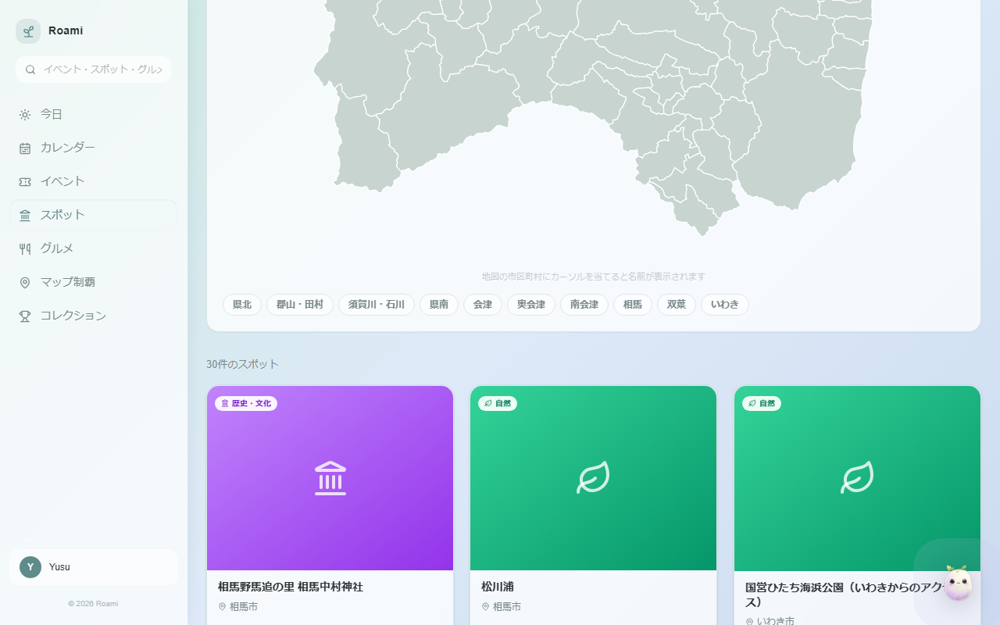

### グルメ・レストラン（HotPepper API 連携）

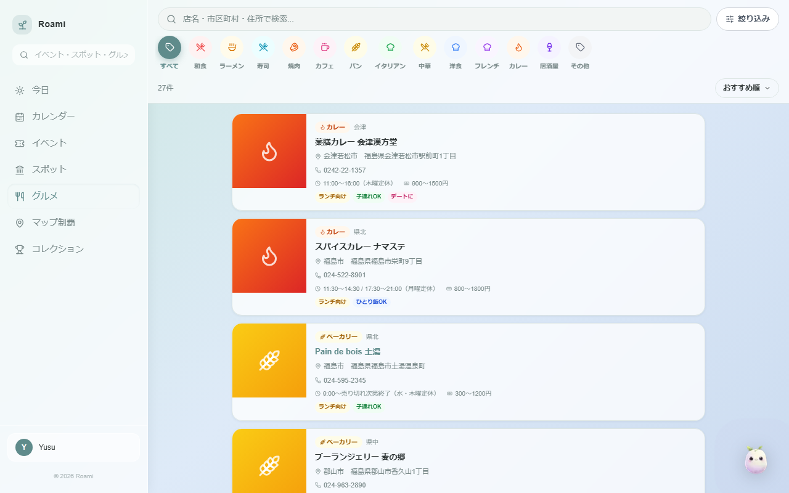

### マップ制覇（福島 59 市町村を制覇しよう）

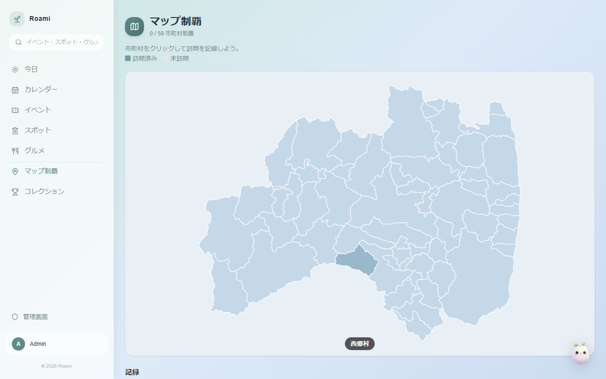

### コレクション（制覇で集まるアイテム）

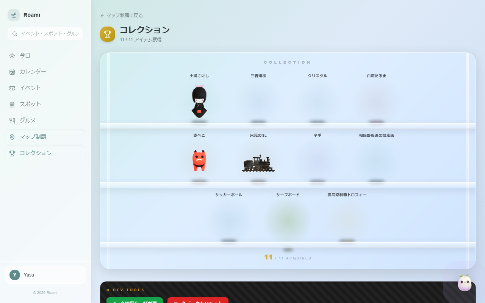

### AI チャット（Google Gemini によるおでかけ提案）

> 画面右下のチャットボタンから起動。イベント・スポット・グルメを横断して提案してもらえます。

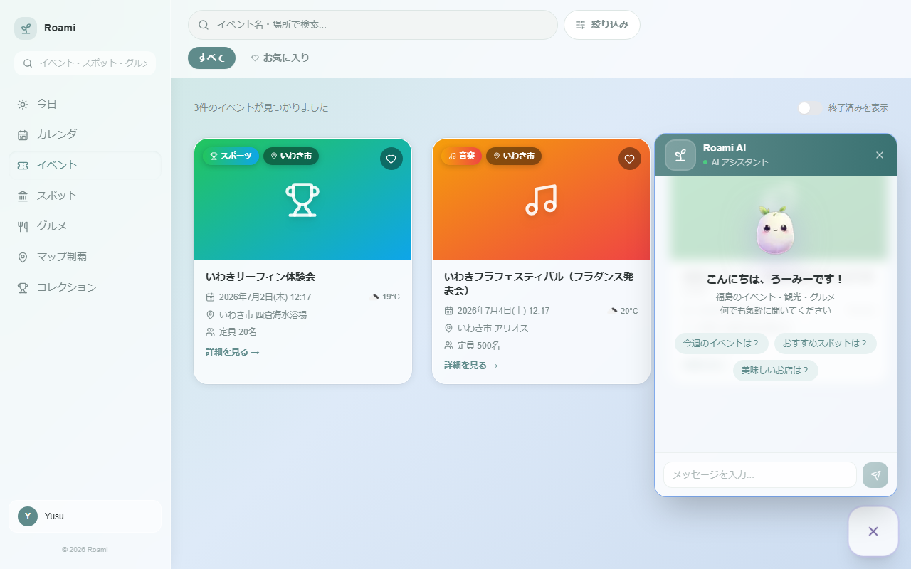

### テーマ変更（100 種以上のテーマから選択）

> 写真・イラスト・グラデーションの 3 カテゴリで背景テーマを自由に切り替えられます。

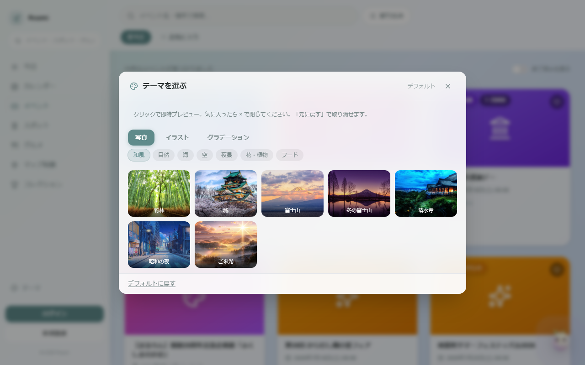

### ログイン画面

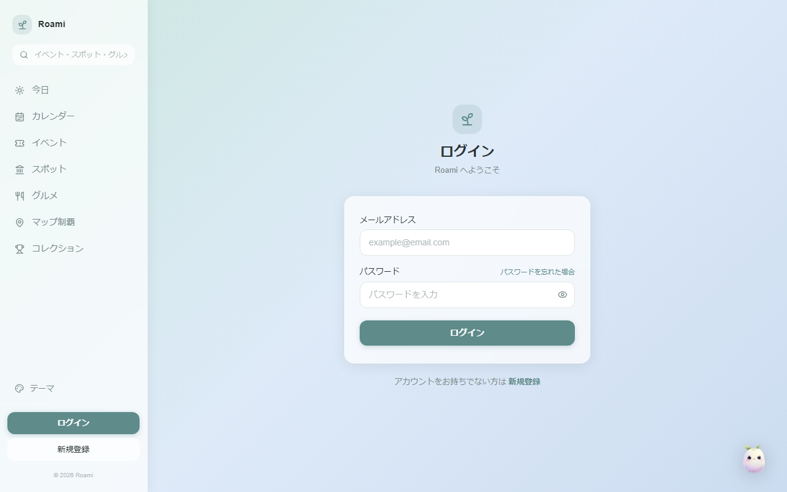

---

## 技術スタック

| レイヤー | 技術 | バージョン |
|----------|------|------------|
| フロントエンド | Next.js (App Router) + TypeScript | Next.js 14 / TypeScript 5 |
| スタイリング | Tailwind CSS | 3.4 |
| アニメーション | Framer Motion | 12 |
| カレンダー | FullCalendar | 6.1 |
| バックエンド | Ruby on Rails（API モード） | Rails 7.2 |
| 言語 | Ruby | 3.3 |
| 認証 | Devise + devise_token_auth | — |
| データベース | MySQL（Docker） | 8.0 |
| 外部 API | Connpass / HotPepper / OpenWeatherMap / Google Gemini | — |
| インフラ | AWS（EC2・RDS）/ Terraform | ap-northeast-1（東京） |
| バージョン管理 | Git / GitHub | — |

---

## ディレクトリ構成

```
Roami/
├── backend/                 # Ruby on Rails（API モード、ポート 8080）
│   ├── app/
│   │   ├── controllers/api/v1/   # API コントローラー
│   │   ├── models/               # ORM モデル
│   │   └── services/             # 外部 API・ビジネスロジック
│   ├── config/
│   │   └── routes.rb             # ルーティング定義
│   └── db/
│       └── schema.rb             # DB スキーマ
├── frontend/                # Next.js（App Router、ポート 3000）
│   └── src/
│       ├── app/             # ページ（App Router）
│       ├── components/      # React コンポーネント
│       ├── contexts/        # 状態管理（Auth / Theme / Favorites）
│       ├── hooks/           # カスタムフック
│       └── types/           # TypeScript 型定義
├── docs/                    # 設計・要件ドキュメント
├── terraform/               # インフラ定義（VPC・EC2・RDS 等）
├── docker-compose.yml       # MySQL 起動設定
└── CLAUDE.md
```

---

## ローカル起動手順

### 前提条件

- Ruby 3.3 以上
- Node.js 18 以上
- Docker Desktop
- 各種 API キー（後述の環境変数を参照）

### 1. リポジトリをクローン

```bash
git clone https://github.com/yusu31/ScheduleManagement.git
cd ScheduleManagement
```

### 2. 環境変数を設定

```bash
# ルートの .env を作成
cp .env.example .env

# バックエンドの .env を作成
cp backend/.env.example backend/.env
```

`.env` と `backend/.env` を開き、実際の値を入力してください（詳細は後述の「環境変数」を参照）。

### 3. MySQL を起動（Docker）

```bash
docker-compose up -d
```

### 4. バックエンドをセットアップ・起動（ポート 8080）

```bash
cd backend
bundle install
bundle exec rails db:create db:migrate db:seed
bundle exec rails s -p 8080
```

### 5. フロントエンドを起動（別ターミナル、ポート 3000）

```bash
cd frontend
npm install
npm run dev
```

ブラウザで http://localhost:3000 を開くとアプリが表示されます。

---

## 環境変数

### ルート (`.env`)

| 変数名 | 内容 |
|--------|------|
| `MYSQL_ROOT_PASSWORD` | MySQL root パスワード |
| `MYSQL_DATABASE` | データベース名（例: `roami_development`） |
| `MYSQL_USER` | MySQL ユーザー名 |
| `MYSQL_PASSWORD` | MySQL パスワード |

### バックエンド (`backend/.env`)

| 変数名 | 内容 |
|--------|------|
| `DB_HOST` | DB ホスト（ローカルは `127.0.0.1`） |
| `MYSQL_USER` | MySQL ユーザー名 |
| `MYSQL_PASSWORD` | MySQL パスワード |
| `MYSQL_DATABASE` | データベース名 |
| `OPENWEATHERMAP_API_KEY` | 天気情報 API キー（OpenWeatherMap） |
| `CONNPASS_API_KEY` | Connpass イベント取得 API キー |
| `HOTPEPPER_API_KEY` | HotPepper グルメ API キー（Recruit） |
| `GEMINI_API_KEY` | Google Gemini AI API キー |

---

## 実装済み機能

### イベント・カレンダー

| 機能 | 説明 |
|------|------|
| イベント一覧・検索 | 地域・カテゴリ・日付・タグで絞り込み、キーワード検索対応 |
| Connpass 自動取得 | Connpass API から福島関連イベントを定期同期 |
| カレンダー表示 | FullCalendar による日・週・月・リスト表示 |
| 個人予定管理 | ログイン後、独自の予定を登録・編集・削除 |
| イベントをカレンダーに追加 | 気になるイベントをワンクリックでカレンダーへ登録 |
| 今日の予定ページ | 本日のスケジュール一覧をまとめて確認 |

### スポット・グルメ

| 機能 | 説明 |
|------|------|
| 観光スポット一覧 | 地域・市町村・カテゴリ・季節でフィルター |
| SVG マップ選択 | 福島県のインタラクティブ地図からエリアを絞り込み |
| グルメ一覧 | HotPepper API 連携。13 カテゴリ・地域フィルター対応 |
| 統合検索 | キーワード 1 つでイベント・スポット・グルメを横断検索 |

### お気に入り・地域制覇

| 機能 | 説明 |
|------|------|
| お気に入り | イベントをお気に入りに登録・一覧で管理 |
| 訪問記録 | 市町村単位で訪問日・同行者・メモを記録 |
| 地域制覇 | 福島10エリアの制覇状況を SVG マップで可視化 |
| 制覇コレクション | 制覇済みエリアの統計・一覧表示 |

### ユーザー・認証

| 機能 | 説明 |
|------|------|
| サインアップ / ログイン | メール・パスワード認証（Devise） |
| パスワードリセット | メールによるパスワード再設定 |
| ユーザー統計 | お気に入り数・訪問市町村数などを表示 |

### AI・天気

| 機能 | 説明 |
|------|------|
| AI チャットボット | Google Gemini を使ったおでかけ提案チャット |
| イベント日の天気 | 開催日の天気情報を OpenWeatherMap API で表示 |

### テーマ・UI

| 機能 | 説明 |
|------|------|
| 100+ テーマ | 写真・グラデーション・イラストなど 15 カテゴリ |
| ダークモード自動判別 | テーマに応じて文字色を自動切り替え |

---

## API エンドポイント

### 認証

| メソッド | パス | 処理 |
|----------|------|------|
| POST | `/auth/sign_up` | サインアップ |
| POST | `/auth/sign_in` | ログイン |
| POST | `/auth/sign_out` | ログアウト |

### イベント

| メソッド | パス | 処理 |
|----------|------|------|
| GET | `/api/v1/events` | イベント一覧（フィルター・ページネーション） |
| GET | `/api/v1/events/:id` | イベント詳細 |

### スポット

| メソッド | パス | 処理 |
|----------|------|------|
| GET | `/api/v1/spots` | スポット一覧（フィルター対応） |
| GET | `/api/v1/spots/:id` | スポット詳細 |

### グルメ

| メソッド | パス | 処理 |
|----------|------|------|
| GET | `/api/v1/restaurants` | レストラン一覧 |
| GET | `/api/v1/restaurants/:id` | レストラン詳細 |

### カレンダー・予定

| メソッド | パス | 処理 |
|----------|------|------|
| GET / POST | `/api/v1/schedules` | スケジュール一覧 / 追加 |
| DELETE | `/api/v1/schedules/:id` | スケジュール削除 |
| GET / POST / PATCH / DELETE | `/api/v1/personal_events` | 個人予定の CRUD |

### お気に入り・訪問記録

| メソッド | パス | 処理 |
|----------|------|------|
| GET / POST / DELETE | `/api/v1/favorites` | お気に入りの一覧 / 追加 / 削除 |
| GET / POST / PATCH / DELETE | `/api/v1/visit_records` | 訪問記録の CRUD |
| GET / POST | `/api/v1/region_conquests` | 地域制覇の一覧 / 登録 |

### AI・天気

| メソッド | パス | 処理 |
|----------|------|------|
| POST | `/api/v1/ai/chat` | AI チャット（Gemini） |
| GET | `/api/v1/weather` | 天気情報取得 |

詳細は [docs/design.md](docs/design.md) を参照してください。

---

## ドキュメント一覧

| ドキュメント | 内容 |
|--------------|------|
| [docs/requirements.md](docs/requirements.md) | 要件定義書（目的・機能一覧・ユースケース） |
| [docs/design.md](docs/design.md) | システム設計書（ER 図・API エンドポイント） |
| [docs/database-design.md](docs/database-design.md) | データベース設計書（テーブル定義） |
| [docs/tech-stack.md](docs/tech-stack.md) | 技術スタック詳細・選定理由 |
| [docs/screen-design.md](docs/screen-design.md) | 画面設計書 |
| [docs/infrastructure.md](docs/infrastructure.md) | インフラ構成（AWS 構成図・Terraform） |
| [docs/expansion-plan.md](docs/expansion-plan.md) | 拡張計画書（Phase 0〜6 の実装ロードマップ） |

---

## 課題提出ファイル（RaiseTech）

| ファイル | 内容 |
|----------|------|
| [AIレビュー結果](docs/assignments/review.md) | Claude（AI）によるコード簡易レビュー |
