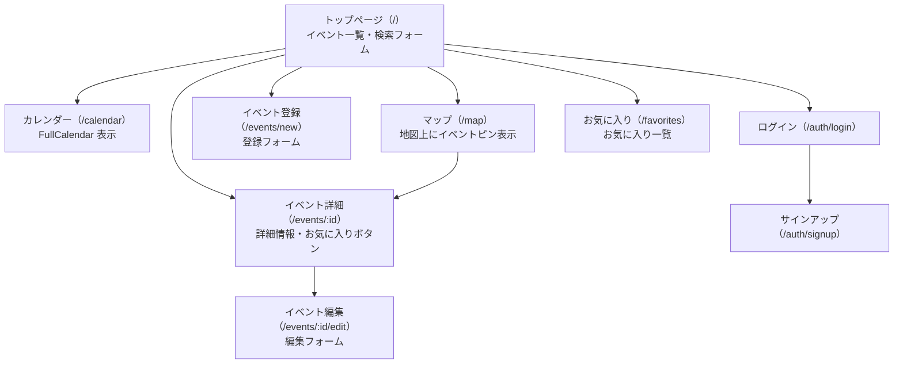
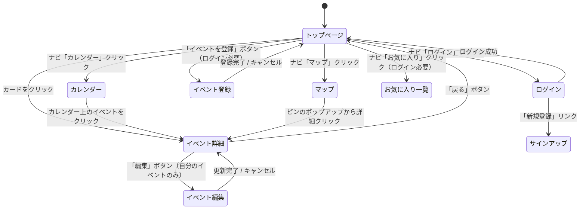

# 要件定義書

## 福島イベントナビ（EventFinder）

| 項目 | 内容 |
|------|------|
| 作成日 | 2026-06-08 |
| バージョン | 1.0 |
| 作成者 | yusu |
| ステータス | 作成中 |

---

## 改訂履歴

| バージョン | 日付 | 変更者 | 変更内容 |
|-----------|------|--------|---------|
| 1.0 | 2026-06-08 | yusu | 初版作成 |
| 1.1 | 2026-06-08 | yusu | 目的・背景・デザイン方針を修正、カレンダーを Phase 1 に移動 |
| 1.2 | 2026-06-08 | yusu | デザイン方針に参考アプリ・カルーセルを追記、地図機能を拡充 |

---

## 1. プロジェクト概要

### 目的

福島県内のイベント情報を自動集約し、  
地域住民や観光客が「今ここで何が起きているか」をひと目で把握できるだけでなく、  
カレンダー機能でイベントの予定管理も一元化できる地域密着型 Web アプリを作成する。

### 背景

- 福島県内のイベント情報が複数サイトに分散しており、まとめて確認できる場所がない
- 福島県内を盛り上げたいという思いがある
- 現在二児のパパとして、家族が楽しめるイベントを見つけたいという個人的な動機がある
- これまでは Instagram でイベント情報をキャッチしていたが、専用ツールで一元管理したい
- 「地域 × 日付 × カテゴリ」で素早く検索できるツールがあれば、参加者・主催者ともに便利
- プログラミングスクール（RaiseTech）の最終課題として、転職ポートフォリオを目的に作成する

---

## 2. 前提条件・制約事項

### 前提条件

- 開発環境は Windows 11 PC + Cursor / Claude Code エディタとする
- バックエンドは Ruby on Rails（API モード）、データベースは MySQL を使用する
  - ローカル開発: Docker（`docker-compose up -d`）でMySQL を起動
  - バックエンド: WSL2（Ubuntu）上で Rails を起動（ポート 8080）
  - フロントエンド: Windows 上で Next.js を起動（ポート 3000）
  - 本番環境: AWS EC2（Rails）+ RDS（MySQL）
- フロントエンドは Next.js（App Router）+ TypeScript で作成する

### 制約事項

- Web スクレイピングは使用しない（法的リスクのため）
- 外部データ取得は Connpass 公式 API のみ使用する
- ポート番号は固定（3000 / 8080 / 3306）とし、変更しない

---

## 3. 対象ユーザー（ペルソナ）

### ペルソナ 1：地域住民・田中さん（35歳）

| 項目 | 内容 |
|------|------|
| 職業 | 郡山市在住の会社員 |
| 利用目的 | 週末に家族で行けるイベントを探したい |
| ITリテラシー | スマートフォンは使いこなせるが、複数サイトを回るのが面倒 |
| 利用環境 | スマートフォン・PCどちらでも利用 |
| 価値観 | 地域密着。近場のイベントをすぐに見つけたい |

### ペルソナ 2：IT エンジニア・佐藤さん（28歳）

| 項目 | 内容 |
|------|------|
| 職業 | いわき市在住のエンジニア |
| 利用目的 | 福島で開催される勉強会・もくもく会を探したい |
| ITリテラシー | 高い。Connpass は使っているが福島限定で絞り込みにくい |
| 利用環境 | PC ブラウザ |
| 価値観 | 効率的に情報を取得したい。カレンダーで一覧したい |

### ユーザーが抱える課題

- 福島県内のイベント情報が分散していて、まとめて把握できない
- Connpass で「福島」のイベントを探すと、絞り込み精度が低い
- 「今週末に何かある？」をひと目で確認できるツールがない

### このアプリで解決すること

- 地域・カテゴリ・日付の絞り込み検索でイベントをすぐ見つけられる
- Connpass のイベントを自動取得し、手動入力の手間を省く
- カレンダー表示で月・週単位のイベントを視覚的に把握できる

---

## 4. 機能一覧

### Phase 1 ― 必須機能（最初に完成させる）

| # | 機能名 | 詳細 | 受け入れ条件 | 実装状況 |
|---|--------|------|-------------|---------|
| F-01 | イベント一覧表示 | 登録済みのイベントをカード形式で一覧表示する | イベント一覧が表示される | 🚧 未実装 |
| F-02 | イベント詳細表示 | イベントの詳細情報（名前・日時・場所・説明）を表示する | イベント詳細ページが表示される | 🚧 未実装 |
| F-03 | ユーザー認証 | サインアップ・ログイン・ログアウトができる | 認証なしでは登録・編集・削除ができない | 🚧 未実装 |
| F-04 | イベント登録 | ログイン後、新しいイベントを登録できる | フォームを入力して登録するとイベントが一覧に表示される | 🚧 未実装 |
| F-05 | イベント編集 | 自分が登録したイベントを編集できる | 他人のイベントは編集できない | 🚧 未実装 |
| F-06 | イベント削除 | 自分が登録したイベントを削除できる | 削除後、一覧からイベントが消える | 🚧 未実装 |
| F-07 | カレンダー表示・予定管理 | FullCalendar でイベントを月・週単位で表示する。参加したいイベントをカレンダーに追加して予定管理ができる | イベントがカレンダー上に表示され、クリックで詳細に遷移できる | 🚧 未実装 |

### Phase 2 ― 追加機能（Phase 1 完成後に追加）

| # | 機能名 | 詳細 | 受け入れ条件 | 実装状況 |
|---|--------|------|-------------|---------|
| F-08 | 絞り込み検索 | 地域・カテゴリ・日付（開始〜終了）でイベントを絞り込める | 条件を指定すると該当イベントのみ表示される | 🚧 未実装 |
| F-09 | Connpass 自動取得 | Connpass API から福島関連イベントを取得して DB に保存する | 重複取得を防ぎ、取得したイベントが一覧に自動表示される | 🚧 未実装 |

### Phase 3 ― 発展機能（Phase 2 完成後に追加）

| # | 機能名 | 詳細 | 受け入れ条件 | 実装状況 |
|---|--------|------|-------------|---------|
| F-10 | お気に入り機能 | ログイン後、イベントをお気に入りに登録・解除できる | お気に入り一覧ページで登録したイベントを確認できる | 🚧 未実装 |
| F-11 | 地図表示（詳細ページ） | イベント詳細ページに地図を表示する（Leaflet.js + OpenStreetMap） | 開催場所の住所から地図上にピンが表示される | 🚧 未実装 |
| F-12 | 地図でイベントを探す | マップページで福島県内のイベントをピンで一覧表示する。ピンをクリックすると写真プレビューと詳細リンクが表示される（Mori Fes 参考） | 地図上のピンからイベント詳細に遷移できる | 🚧 未実装 |

---

## 5. ユースケース

### UC-01：イベントを探す

- **目的：** 週末に参加できるイベントを見つける
- **手順：**
  1. トップページを開く
  2. 地域「郡山市」・日付「今週末」で絞り込む
  3. 表示されたイベント一覧からカードをクリックする
- **結果：** イベントの詳細情報（日時・場所・説明・URL）が表示される

### UC-02：新しいイベントを登録する

- **目的：** 主催するイベントを告知する
- **手順：**
  1. ログインする
  2. 「イベントを登録」ボタンをクリックする
  3. タイトル・日時・場所・カテゴリ・説明を入力して送信する
- **結果：** イベントが一覧に表示される

### UC-03：イベントを編集する

- **目的：** 登録したイベントの情報を更新する
- **手順：**
  1. ログイン状態でイベント詳細を開く
  2. 「編集」ボタンをクリックする
  3. 内容を変更して保存する
- **結果：** 更新された情報が詳細ページに反映される

### UC-04：カレンダーでイベントを確認する

- **目的：** 月単位でどのくらいイベントがあるか把握する
- **手順：**
  1. ナビゲーションバーの「カレンダー」をクリックする
  2. カレンダー上のイベントをクリックする
- **結果：** イベント詳細ページに遷移する

### UC-05：Connpass からイベントを取得する

- **目的：** 手動入力なしで Connpass のイベントを一覧に追加する
- **手順：**
  1. 管理者が「Connpass から取得」ボタンを押す（MVP では手動実行）
- **結果：** 福島関連イベントが自動で DB に保存され、一覧に表示される

---

## 6. 画面一覧

### 画面構成



### 初期表示

アプリ起動時（トップページ）に以下を表示する：

1. **検索フォーム**（地域・カテゴリ・日付）
2. **イベントカード一覧**（写真グリッド・新着順）
3. **ナビゲーションバー**（カレンダー / マップ / ログイン / お気に入り）

### 画面遷移



---

## 7. 非機能要件

| 項目 | 内容 |
|------|------|
| 対応ブラウザ | Google Chrome（最新版） |
| レスポンシブ対応 | スマートフォン・PC どちらでも使えること |
| ユーザー認証 | あり（Devise）。ログイン後のみイベント登録・編集・削除が可能 |
| データ永続化 | MySQL（Rails API 経由）。本番は AWS RDS |
| 通信（ローカル） | Next.js（ポート 3000）→ Rails（ポート 8080）→ MySQL（ポート 3306） |
| 通信（本番） | ブラウザ → nginx（ポート 80）→ Rails → RDS |
| ホスティング | AWS EC2（ap-northeast-1 東京リージョン） |

---

## 8. デザイン方針

### コンセプト

**「Instagram のようにビジュアルでイベントを発見できる」**

これまでは Instagram でイベント情報をキャッチしていた体験を参考に、  
文字中心ではなく写真・画像を前面に出した視覚的に楽しいデザインを目指す。

### 参考デザイン

**Mori Fes**（フェスイベント管理アプリ）のデザインを参考にする。

| 参考にする点 | 内容 |
|------------|------|
| 写真グリッド一覧 | サムネイル写真を並べたグリッドレイアウトでイベント・会場を一覧表示 |
| 写真カルーセル | 詳細ページで複数枚の写真を横スクロールで閲覧できる |
| 地図 + ピン表示 | 地図上にイベントの開催場所をピンで表示し、クリックで詳細を確認できる |
| 落ち着いたカラー | グレイッシュグリーン系の上品で読みやすいカラーパレット |

### カラーパレット

| 用途 | 方針 |
|------|------|
| 全体のトーン | グレイッシュグリーン系（Mori Fes 参考）。落ち着いていて写真が映える配色 |
| メインカラー | くすみグリーン・テールカラー（自然・地域らしさ） |
| 強調色 | 期限が近いイベントのみ警告色を使用 |

### UI コンポーネント

| 項目 | 方針 |
|------|------|
| イベントカード | **写真をメインビジュアルに据えた大判カード**。画像・タイトル・日時・カテゴリを視覚的に表示 |
| 画像 | 各イベントに画像URLを登録できる。Connpass取得イベントは `event_image` を自動セット。画像未設定時はカテゴリ別デフォルト画像を表示 |
| 写真カルーセル | 詳細ページで複数枚の写真をスライド表示できる（Swiper 等を使用） |
| 一覧レイアウト | グリッドレイアウト（写真主体）でイベントを並べ、スクロールで発見できる体験 |
| 検索フォーム | トップに配置。写真一覧を崩さないコンパクトなフォーム |
| 全体の雰囲気 | 「見ているだけで楽しい」写真中心の UI。家族でスマートフォンを見ながら使えるデザイン |

---

## 9. ワイヤーフレーム

### WF-01：トップページ（イベント一覧）

```
+------------------------------------------------------+
| 福島イベントナビ  [カレンダー] [マップ] [ログイン]   |
+------------------------------------------------------+
| 地域 [v]  カテゴリ [v]  日付[____]〜[____] [検索] |
+------------------------------------------+
| +----------------+  +----------------+   |
| |  [イベント写真]  |  |  [イベント写真]  |   |
| |                |  |                |   |
| | タイトル        |  | タイトル        |   |
| | 📅 06/15 14:00 |  | 📅 06/20       |   |
| | 📍 郡山市       |  | 📍 いわき市     |   |
| | 🏷 音楽        |  | 🏷 スポーツ     |   |
| +----------------+  +----------------+   |
|                                          |
| +----------------+  +----------------+   |
| |  [イベント写真]  |  |  [イベント写真]  |   |
| |  ...           |  |  ...           |   |
| +----------------+  +----------------+   |
+------------------------------------------+
（写真グリッドを縦スクロールで発見していくデザイン）
```

### WF-02：イベント詳細ページ

```
+------------------------------------------+
| 福島イベントナビ  [カレンダー] [マップ] [ログイン]  |
+------------------------------------------+
| ← 戻る                                   |
|                                          |
| 【イベントタイトル】          [編集][削除] |
|                                          |
| 📅 2026-06-15（月）14:00〜17:00          |
| 📍 郡山市 ビッグパレットふくしま          |
| 🏷 カテゴリ: IT勉強会                    |
| 🌐 https://connpass.com/event/...        |
|                                          |
| 【説明】                                  |
| イベントの詳細説明テキスト...             |
|                                          |
| [♡ お気に入りに追加]                     |
+------------------------------------------+
```

### WF-03：イベント登録フォーム

```
+------------------------------------------+
| 福島イベントナビ  [カレンダー] [マップ] [ログイン]  |
+------------------------------------------+
| イベントを登録する                        |
|                                          |
| タイトル: [____________________________] |
| 地域:     [郡山市 v]                     |
| カテゴリ: [IT v]                         |
| 開始日時: [__________]                   |
| 終了日時: [__________]（任意）           |
| 開催場所: [____________________________] |
| 外部URL:  [____________________________]（任意）|
| 説明:     [                            ] |
|           [                            ] |
|                                          |
|          [登録する]  [キャンセル]         |
+------------------------------------------+
```

### WF-04：マップ画面

```
+------------------------------------------------------+
| 福島イベントナビ  [カレンダー] [マップ] [ログイン]   |
+------------------------------------------------------+
|                                                      |
|   [福島県地図]                                       |
|   ・                                                 |
|      📍（クリックすると↓）                           |
|      +-------------------------+                     |
|      | [イベント写真サムネイル] |                     |
|      | イベントタイトル         |                     |
|      | 📅 06/15  📍 郡山市     |                     |
|      | [詳細を見る →]          |                     |
|      +-------------------------+                     |
|          📍    📍                                    |
|      📍                                              |
|                                                      |
+------------------------------------------------------+
（ピンをクリック → ポップアップで写真＋概要 → 詳細ページへ）
```

### WF-05：カレンダー画面

```
+------------------------------------------+
| 福島イベントナビ  [カレンダー] [マップ] [ログイン]  |
+------------------------------------------+
| ← 2026年6月 →  [月表示 v]               |
+----+----+----+----+----+----+----+-------+
| 日 | 月 | 火 | 水 | 木 | 金 | 土 |       |
+----+----+----+----+----+----+----+       |
|    |  1 |  2 |  3 |  4 |  5 |  6 |       |
|    |    |    |[勉強会]   |    |    |       |
+----+----+----+----+----+----+----+       |
|  7 |  8 |  9 | 10 | 11 | 12 | 13 |       |
|    |[イベント]  |    |    |    |    |       |
+----+----+----+----+----+----+----+-------+
（イベントをクリック → 詳細ページへ遷移）
```

---

## 10. 技術スタック

詳細は [docs/tech-stack.md](./tech-stack.md) を参照。

### 概要

| 役割 | 技術 |
|------|------|
| フロントエンド | Next.js 14.x + TypeScript（App Router） |
| バックエンド | Ruby on Rails 7.2.x（API モード） |
| データベース | MySQL 8.0（Docker） |
| 認証 | Devise |
| カレンダー | FullCalendar |
| 外部 API | Connpass API v1 |
| デプロイ | AWS EC2 + RDS |

---

## 11. インフラ構成

詳細は [docs/infrastructure.md](./infrastructure.md) を参照（インフラ設計フェーズで作成予定）。

---

## 12. データ設計

ER 図・テーブル定義は [docs/database-design.md](./database-design.md) を参照。  
API エンドポイント設計は [docs/design.md](./design.md) を参照。

### テーブル一覧

| テーブル | 説明 |
|----------|------|
| users | ユーザー情報（Devise が管理） |
| events | イベント情報 |
| favorites | お気に入り（users と events の中間テーブル） |

---

## 13. リスクと対策

| # | リスク | 影響 | 対策 |
|---|--------|------|------|
| R-01 | Connpass API の仕様変更・廃止 | 自動取得が動かなくなる | 手動登録でも運用できる設計にする |
| R-02 | Windows + WSL2 環境での開発トラブル | 開発が止まる | 問題が起きたら Docker で Rails を動かす方針に切り替える |
| R-03 | Devise の設定が複雑で認証実装に詰まる | Phase 1 が完成しない | devise-token-auth gem を使い、Rails の公式ドキュメントに従って実装する |
| R-04 | Next.js の App Router の学習コスト | フロント実装が遅れる | Next.js 公式ドキュメント・サンプルを参考にし、困ったら Haiku で質問する |

---

## 14. 開発フェーズとスケジュール

| フェーズ | 内容 | 目標 |
|----------|------|------|
| 準備 | 要件定義・設計・環境構築 | 開発を始められる状態にする |
| Phase 1 | 必須機能（F-01〜F-07）の実装 | アプリとして動く状態にする |
| Phase 2 | 追加機能（F-08〜F-09）の実装 | より実用的にする |
| Phase 3 | 発展機能（F-10〜F-12）の実装 | 本格的なポートフォリオに仕上げる |
| 仕上げ | README・スクリーンショット・デモ動画 | GitHub で公開できる状態にする |
